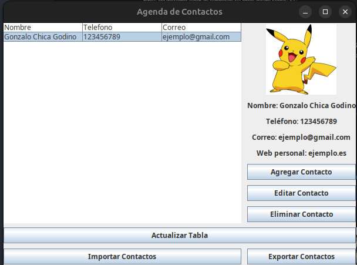

# 📇 Gestor de Contactos en Java

Aplicación de escritorio desarrollada en **Java Swing** que permite gestionar contactos de manera sencilla y práctica.  
Los contactos se almacenan en **SQLite** y se pueden **añadir, editar, eliminar, importar y exportar en JSON**, incluyendo su imagen, correo y web personal.

---

## 🚀 Características

✅ **Interfaz gráfica intuitiva** con Java Swing  
✅ **Base de datos SQLite** integrada  
✅ **CRUD completo** (Crear, Leer, Actualizar y Eliminar contactos)  
✅ **Importación y exportación en JSON**  
✅ **Soporte para imágenes de contacto**  
✅ **Prevención de duplicados** al importar  
✅ Código **bien estructurado y documentado**

---

## 🖼️ Captura de Pantalla



---

## 🛠️ Tecnologías Utilizadas

- **Java 8+**
- **Swing** (Interfaz gráfica)
- **SQLite** (Base de datos)
- **JDBC** (Conexión a base de datos)
- **Gson** (Importación/Exportación de contactos en JSON)

---

## 📂 Estructura del Proyecto

    src/
    └── AgendaContactos/
    ├── Main.java # Punto de entrada, inicializa la BD y la UI
    ├── VentanaPrincipal.java # Ventana principal con tabla de contactos
    ├── VentanaAgregarContacto.java # Ventana para añadir/editar contactos
    ├── contactos.sql # Script SQL para crear la base de datos
    └── contactos.db # Base de datos SQLite


---

## ▶️ Cómo Ejecutar

1. Clona el repositorio:
   ```bash
   git clone https://github.com/gonzalocg123/AgendaContactos.git
   cd AgendaContactos
2. Compila y ejecuta el proyecto desde tu IDE (IntelliJ / Eclipse / NetBeans) o por terminal:
    ```bash
    javac -d bin src/AgendaContactos/*.java
    java -cp bin AgendaContactos.Main
3. La aplicación creará automáticamente la base de datos en src/AgendaContactos/contactos.db si no existe.

---

## 📤 Exportar / Importar Contactos

- **Exportar:** Genera un archivo .json con todos los contactos existentes.
- **Importar:** Permite cargar contactos desde un archivo .json.
(Los contactos duplicados no serán añadidos nuevamente).

---

## 🏗️ Próximas Mejoras
- 🔍 Barra de búsqueda para filtrar contactos por nombre o teléfono.

- ☁️ Sincronización con servicios en la nube.

- 📱 Versión adaptada para móviles (JavaFX o Android).

---

# 👨‍💻 Autor

**Gonzalo Chica Godino**

- 📧 chicagodinogonzalo@gmail.com

- 🌐 [Perfil de GitHub](https://github.com/gonzalocg123)

---

# 📜 Licencia

Este proyecto se distribuye bajo la licencia **MIT**.  
Eres libre de usarlo, modificarlo y compartirlo, siempre mencionando al autor original.
